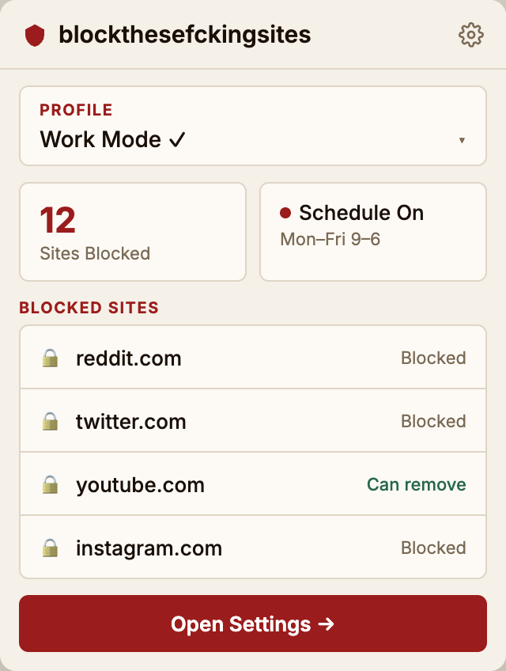
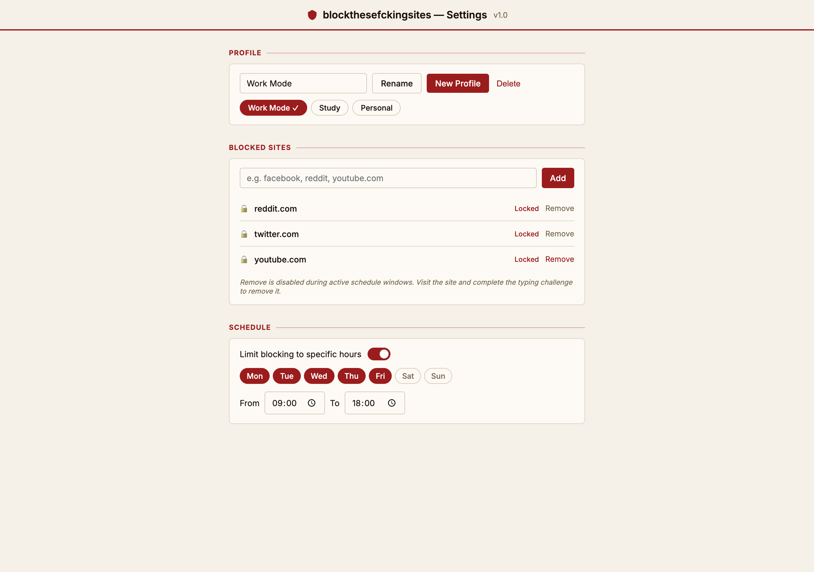
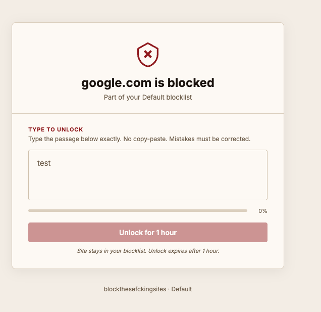

# blockthesefckingsites

A Manifest V3 Chrome extension that permanently blocks distracting sites, protected by a typing challenge removal gate.

## Screenshots

<table>
  <tr>
    <td align="center"><b>Popup</b></td>
    <td align="center"><b>Settings</b></td>
    <td align="center"><b>Block Page</b></td>
  </tr>
  <tr>
    <td valign="top"></td>
    <td valign="top"></td>
    <td valign="top"></td>
  </tr>
</table>

## Features

- **Permanent blocking** — Sites stay blocked until explicitly removed via typing challenge
- **Schedule gate** — Removal only permitted outside configured blocking windows
- **Typing challenge** — Must type a full developer-configured paragraph to remove a site
- **Named profiles** — Multiple independent blocklists (Work Mode, Study, etc.)
- **Domain normalization** — Type `facebook`, get `facebook.com`
- **Active tab sweep** — Already-open tabs are redirected immediately when schedule activates
- **Incognito coverage** — Blocking applies in incognito windows

## Installation (Development)

1. Clone the repo
2. Open `chrome://extensions`
3. Enable **Developer mode** (top-right toggle)
4. Click **Load unpacked** → select this directory
5. Pin the extension from the puzzle-piece menu

## Usage

1. Click the extension icon → **Open Settings**
2. Under **Blocked Sites**, type any domain (`facebook`, `reddit.com`, `youtube`) and click **Add**
3. Optionally enable **Limit blocking to specific hours** and configure the schedule
4. Visit a blocked site — you'll see the block page
5. To remove a site: visit the block page, complete the typing challenge, click **Remove Site**

## Architecture

```
manifest.json
background/service-worker.js   ← orchestrates all engines
lib/
  storage.js                   ← chrome.storage.local wrapper
  block-engine.js              ← URL matching + tab sweep
  schedule-engine.js           ← time-window evaluation
  domain-normalizer.js         ← input → canonical domain
  profile-manager.js           ← profile CRUD + switching
  removal-manager.js           ← two-gate removal logic
popup/                         ← popup.html / popup.css / popup.js
options/                       ← options.html / options.css / options.js
blocked/                       ← blocked.html / blocked.css / blocked.js
icons/
```

## Security Design

| Measure | Details |
|---|---|
| DOM text extraction mitigation | Characters rendered via CSS `::before { content: attr(data-c) }` — `textContent` is empty |
| Clipboard interception | `copy`/`cut` events on the typing area are intercepted and cleared |
| Challenge non-persistence | Challenge must be retyped every time — prevents pre-queuing a removal |
| Schedule gate | Even with challenge complete, removal is rejected during active blocking windows |
| Hard limit accepted | Extension uninstall / DevTools cannot be prevented — this is a self-discipline tool |

## Customizing the Challenge Text

Edit `config.unlockChallengeText` in `lib/storage.js` (`DEFAULTS` object):

```js
const DEFAULTS = {
  // ...
  config: {
    unlockChallengeText: 'Your custom challenge paragraph here.',
  },
};
```

After changing, reload the extension and clear storage (`chrome.storage.local.clear()`) to apply.